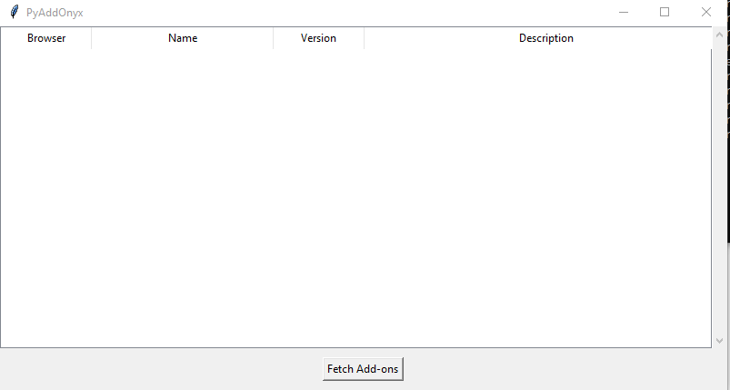

# PyAddOnyx
A very crude and simple tool to display the details of the Chrome and Firefox web browser addons/plugins installed in your system. 
PyAddOnyx detects and scans all web browser profiles if there are multiple profiles.


## Pre-requisites:
None

## Usage
Navigate to the directory where the script is located and run it as:
```
python .\PyAddOnyx.py
```
## Screenshots
\

